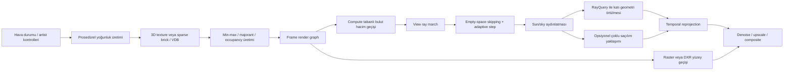
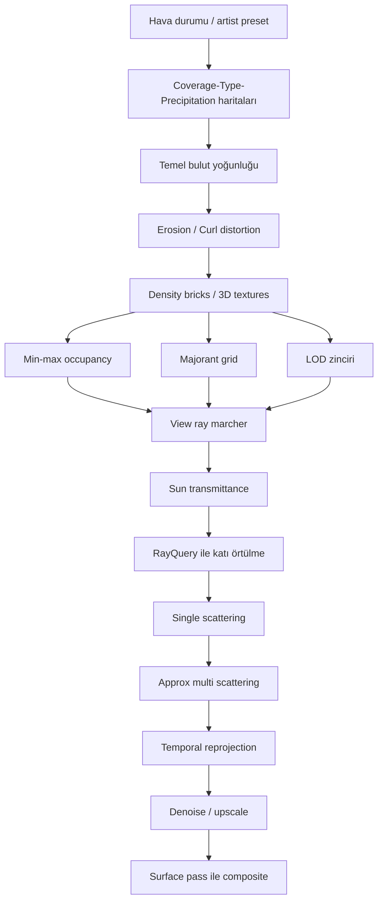

# DXR Tabanlı Gerçek Zamanlı Bir Motorda V-Ray ve Vantage Benzeri Hacimsel Bulut Kalitesini Yeniden Üretmek

## Yönetici özeti

Bu raporun ana sonucu şudur: V-Ray ile Chaos Vantage’daki bulut görünümünü gerçek zamanlı bir DXR motorda “aynı algoritmayı kopyalayarak” değil, aynı görsel etkiyi üreten **katmanlı yoğunluk alanı + fiziksel saçılım + zaman içinde biriken örnekleme + agresif boş-uzay atlama** birleşimiyle yakalamak en doğru yaklaşımdır. Güncel entity["company","Chaos","rendering software company"] belgeleri, V-Ray tarafında prosedürel gökyüzü bulutları, Environment Fog ve Volume Grid/VDB tabanlı volumetrik nesneler; Vantage tarafında ise Physical Sky bulut sistemi, iki katmanlı aerial perspective fog, scattering fog, gerçek hacim (Volume Grid), gerçek zamanlı DXR gereksinimi, denoiser/DLSS seçenekleri ve hücre-temelli step-size kontrolleri sunduğunu açıkça gösteriyor. Buna karşılık, belgeler iç yoğunluk sentezinin ya da integratörün tüm dahili ayrıntılarını açıklamıyor; dolayısıyla bu raporda “belgelenen davranış” ile “yüksek güvenli mühendislik çıkarımı” ayrıştırılmıştır. citeturn5view1turn7view0turn7view2turn7view3turn8view0turn27search1turn31search0

Pratik çıkarım şudur: V-Ray/Vantage benzeri mekânsal kalite için en iyi gerçek zamanlı çözüm, **ekran uzayı ya da compute tabanlı ana bulut ray-march geçişi** ile **DXR RayQuery/inline ray tracing tabanlı yüzey ve sert örtülme sorgularını** birleştiren hibrit bir mimaridir. Saf “tüm hacmi DXR hit group içinde çöz” yaklaşımı mümkündür; fakat shader tablo karmaşıklığı, divergence ve brick-atlamalı ilerleme gibi nedenlerle çoğu üretim motorunda bakım maliyeti daha yüksektir. Buna karşılık, tam ekran hacim geçişi içinde makro-voksel majorant, empty-space skipping, temporal reprojection, yarım/çeyrek çözünürlük denoising ve gerektiğinde DXR gölge sorguları birleştirildiğinde 30/60/90+ FPS için ayrı kalite katmanları tanımlamak mümkündür. Bu yaklaşım güncel DXR 1.1/1.2 özellikleri, Vantage’ın gerçek zamanlı ray-traced çalışma biçimi, NanoVDB/OpenVDB temelli sparse volumetrics pratiği ve Volumetric ReSTIR/real-time denoising araştırmalarıyla uyumludur. citeturn14view0turn14view1turn16search0turn17search8turn21view6turn21view7turn33search14turn33search1turn34search4

En kritik tasarım kararı, hacmi bir “tekil 3D noise shader” olarak değil, **çok ölçekli bir veri/aydınlatma sistemi** olarak düşünmektir: düşük frekansta coverage/type/height gradyanı; orta frekansta taban bulut formu; yüksek frekansta erosion/curl distortion; aydınlatma tarafında HG tabanlı anizotropik tek saçılım; maliyet izin verdiği ölçüde çevresel çoklu saçılım yaklaşımı; denoiser ve temporal history; veri tarafında dense 3D texture, sparse brick grid ya da VDB/NanoVDB. Özellikle Horizon yaklaşımındaki iki seviyeli gürültü, Perlin-Worley taban bulut formu, Worley erosion, curl distortion ve Beer + HG temelli aydınlatma; Vantage’ın prosedürel cloud/fog parametreleriyle görünüş olarak çok yakın bir gerçek zamanlı karşılık üretmek için hâlâ son derece uygulanabilir bir şablondur. citeturn35view0turn35view1turn35view2turn35view3turn35view4turn36view0turn36view1turn36view2turn36view3turn8view0turn11search0

## V-Ray ve Vantage’da bulut modelinin teknik çözümlemesi

V-Ray’in kamuya açık dokümantasyonunda bulut sistemi iki ayrı problem ailesi olarak ortaya çıkıyor. Birincisi, **V-Ray Sun/Sky içindeki prosedürel gökyüzü bulutları**: density, variety, cirrus amount, height, thickness, offset, phase, ground shadows, contrails ve dinamik cloud/wind parametreleri ile kontrol ediliyor. V-Ray SDK sınıf başvurusu bu parametrelerin aralıklarını da veriyor: örneğin `CloudsDensity` 0–1, `CloudsVariety` 0–1, `CloudsHeight` 500–5000 m, `CloudsThickness` 10–1000 m ve faz/offset parametreleri GPU’da da destekleniyor. İkincisi, **gerçek katılımcı ortamlar**: `VRayEnvironmentFog` ve `VRayVolumeGrid`. Environment Fog; fog color, fog distance, fog transparency, fog emission ve phase function ile yönlü saçılımı tanımlıyor; 3D texture map ile sürülebiliyor ve gizmo’larla hacim sınırlandırması yapılabiliyor. Volume Grid ise OpenVDB, Field3D ve PhoenixFD/AUR gibi grid-cache formatlarını okuyor. V-Ray GPU tarafı ayrı bir render engine olarak tanımlanıyor ve V-Ray belgeleri GPU tarafında probabilistic volumetrics’in etkin olduğunu, direct/GI sample sayılarını düşük tutarak gürültü-karşılığında hız kazandığını açık biçimde belirtiyor. citeturn5view1turn37search0turn7view0turn10view0turn10view1turn29search1turn27search3

Chaos Vantage’da sistem daha belirgin biçimde “gerçek zamanlı DXR görselleştirici” mantığıyla bölünmüş durumdadır. Official docs, Environment sekmesinde ayrı roll-out’lar halinde **Clouds**, **Wind**, **Fog** ve ayrıca nesne düzeyinde **Volume Grid** sunduğunu gösteriyor. Clouds rollout; density, density multiplier, variety, cirrus amount, ground shadows, improved shading, offset/phase, start height ve thickness parametrelerine sahip. Fog rollout ise iki adet aerial perspective fog katmanının yanında ayrı bir **scattering fog** içeriyor; burada fog color, fog distance, transparency, emission, height, start/end, light boost, max opacity, secondary rays, scatter GI ve “yalnız sonsuz yönlü ışıklar etkilesin” gibi gerçek zamanlı maliyet kontrolü açıkça görülen parametreler bulunuyor. Dahası, built-in smoke density modunda fractal smoke size, iteration count, exponent, ground fog ve doğrudan ray-march step size / max steps parametreleri de kullanıcıya açık. Volume Grid ise OpenVDB ve Phoenix/AUR tabanlı grid cache’leri okuyup step size ve shadow step size’ı hücre boyutunun yüzdesi olarak ayarlıyor; `Scatter GI` ile GI ışınlarının hacimden geçmesini sağlıyor. citeturn7view4turn8view0turn8view1turn7view3turn11search0turn7view2turn38search2

Vantage’ın kamuya açık ürün ve doküman dili, onun **tamamen offline’daki kadar serbest bir volumetric integrator** değil, **gerçek zamanlı ama doğruluğu yüksek bir progressive/temporally accumulated ray-traced sistem** olduğunu düşündürüyor. Belgeler açıkça “DXR-compatible GPU” gerektiriyor, “100% ray-traced real-time” ifadesini kullanıyor, RTXDI desteğini öne çıkarıyor ve DLSS Ray Reconstruction, OptiX AI, Intel OIDN, Vantage denoiser ile temporal denoising/AA seçenekleri sunuyor. Aynı zamanda Clouds içindeki “Improved shading – results are better in offline rendering” ve Fog içindeki “Scatter GI can be quite slow; emission term often substitutes GI” cümleleri, gerçek zamanlı modda tam çoklu saçılım yerine kontrollü kestirim ve gürültü azaltma kullanıldığına işaret ediyor. Bu, DXR motorunuz için de doğru hedefi belirler: **offline fiziksel referans + gerçek zamanlı kontrollü yaklaşım**. citeturn27search1turn27search4turn27search19turn5view9turn8view0turn7view3turn31search0

Belgelenen arayüzlerden hareketle yüksek güvenli bir iç model çıkarımı yapılabilir. V-Ray/Vantage’daki prosedürel cloud görünümü, büyük olasılıkla tek bir “bulut fonksiyonu”ndan ibaret değildir; daha ziyade **coverage / type / height gradient ile modüle edilen düşük frekanslı bir 3D taban yoğunluk alanı**, bunun üzerine uygulanan **yüksek frekanslı erosion ve distortion**, ayrı bir **cirrus katmanı** ve daha geniş atmosfer için **aerial perspective/fog katmanları**ndan oluşur. Bu çıkarım, hem V-Ray’in public cloud parametre kümesiyle, hem Vantage’ın clouds + fog ayrımıyla, hem de entity["video_game","Horizon Zero Dawn","2017 action game"] sunumunda anlatılan Perlin-Worley taban biçimi + Worley erosion + curl distortion + weather coverage/type kontrolü ile çok güçlü biçimde örtüşür. Bu yüzden, V-Ray/Vantage “görünüşünü” kopyalamak isteyen DXR motoru için en doğru soyutlama, bulutu doğrudan bir shader efekti değil, **çok katmanlı yoğunluk alanı** olarak tasarlamaktır. citeturn35view0turn35view4turn36view0turn36view1turn8view0turn11search0turn5view1turn37search0

## Hacimsel ışık taşıma, matematik ve çekirdek algoritmalar

Katılımcı ortamın fiziksel çekirdeği üç katsayıyla başlar: emilim \( \sigma_a(\mathbf{x}) \), saçılım \( \sigma_s(\mathbf{x}) \) ve toplam zayıflama/ekstinksiyon \( \sigma_t(\mathbf{x}) = \sigma_a(\mathbf{x}) + \sigma_s(\mathbf{x}) \). Bir ışın boyunca transmittance tipik olarak Beer-Lambert yasasıyla yazılır:

\[
T(\mathbf{x}_0 \to \mathbf{x}_1) =
\exp\!\left(
-\int_0^d \sigma_t(\mathbf{x}(s))\, ds
\right).
\]

Hacimsel ışık taşımanın diferansiyel formu ise radyatif transfer denklemiyle verilir:

\[
\frac{dL(\mathbf{x},\omega)}{ds}
=
-\sigma_t(\mathbf{x})L(\mathbf{x},\omega)
+\sigma_s(\mathbf{x})
\int_{4\pi}
p(\omega_i,\omega)
L(\mathbf{x},\omega_i)\, d\omega_i
+L_e(\mathbf{x},\omega).
\]

Burada ilk terim out-scattering + absorption kaybını, ikinci terim in-scattering kazancını, üçüncü terim emisyonu temsil eder. pbrt’nin hacim bölümleri ve ilgili ders notları bu ayrımı açık biçimde verir; özellikle kaynak terimi ve toplam zayıflama teriminin ayrıştırılması, gerçek zamanlı motorda tek saçılım ile yaklaşık çoklu saçılımı ayrı katmanlar halinde tasarlamayı kolaylaştırır. citeturn39view0turn39view1turn40view0turn25search12

Bulutlarda yönlü saçılım baskındır; bu yüzden Henyey–Greenstein faz fonksiyonu hâlâ standart ilk seçimdir. Yaygın biçimiyle:

\[
p_{HG}(\mu; g)=
\frac{1-g^2}{4\pi \left(1+g^2-2g\mu\right)^{3/2}},
\qquad \mu=\cos\theta.
\]

\(g=0\) izotropiktir; \(g>0\) ileri saçılımı, \(g<0\) geri saçılımı artırır. pbrt bunun “mean cosine” yorumu üzerinden açık tanımını verir; Horizon sunumu da anizotropik cloud lighting için HG kullanımını doğrudan gösterir. Gerçek zamanlı bulutlarda tipik hedef, fiziksel olarak tam Mie saçılımı değil, HG veya HG-benzeri bir/iki-loblu yaklaşım ile güneş çevresindeki silver lining, iç beyazlık ve yönlü parlama hissini yakalamaktır. citeturn21view0turn36view2turn35view1

Tek saçılım için pratik render denklemi genelde şu forma indirgenir:

\[
L_{ss}(\omega_v)
\approx
\int_0^{d}
T_{view}(s)\;
\sigma_s(\mathbf{x}_s)\;
p(\omega_l,\omega_v)\;
T_{light}(\mathbf{x}_s \to \text{light})\;
L_{light}\; ds.
\]

Gerçek zamanlı bulut görünümünün büyük kısmı bu integralden gelir: gövde şeffaflığı, kenardaki parlaklık, god rays ve bulut gölgeleri. Vantage’ın scatter fog ve volume grid ayarları da bu pratiği yansıtır: ayrı view-step ve shadow-step uzunlukları, yalnız sonsuz direct lights seçeneği, emission ile GI yerine geçebilme ve step-size artınca hız/artefakt takası. Yani DXR motorunda öncelik, tek saçılım integralini **en düşük noise ile** çözmek olmalıdır; tam çoklu saçılım ikinci aşamadır. citeturn7view2turn7view3turn11search0

Çoklu saçılım ise kaliteyi “Chaos benzeri” yapan ama en pahalı bileşendir. Offline tarafta volumetric path tracing ya da monte carlo null-collision yöntemleriyle unbias veya düşük bias çözümler mümkündür; ancak gerçek zamanlı tarafta çoğunlukla üç kategori tercih edilir: düşük mertebeli kapalı-form yaklaşım, precomputed ambient/irradiance yaklaşımı, ya da daha gelişkin importance sampling/resampling temelli yeni araştırmalar. Horizon sunumu Beer + HG + “powder” benzeri hilelerle yönlü aydınlatmayı ucuzlaştırırken, literatürde Residual Ratio Tracking ve Spectral/Decomposition Tracking heterojen ortamlarda unbiased transmittance ve free-path örneklemeyi iyileştirir; Volumetric ReSTIR ise dinamik ışıklandırmada bir path örneğini tam değerlendirip diğer adayları yeniden örnekleyerek interaktif kaliteye yaklaşır. DXR motoru için sonuç nettir: 60/90 FPS hedeflerinde tam volumetric path tracing yerine **tek saçılım + ucuz çoklu saçılım yaklaşımı**, 30 FPS “hero shot” hedefinde ise reserve edilmiş ek örneklerle daha ileri çözüm en dengeli seçenektir. citeturn22search11turn22search18turn22search13turn33search14turn21view8

Delta tracking, ratio tracking ve residual/decomposition tracking özellikle heterojen bulutlar için önemlidir; çünkü düzenli aralıkla ray march etmek, yoğunluk çoğu yerde sıfıra yakınken gereksiz örnek israf eder. Delta/null tracking’de önce bir majorant \( \sigma_{maj} \) seçilir, mesafe \( t=-\ln(1-\xi)/\sigma_{maj} \) ile örneklenir ve gerçek çarpışma \( \sigma_t(\mathbf{x})/\sigma_{maj} \) olasılığıyla kabul edilir. Ratio tracking, gerçek çarpışma üretmeden transmittance’i doğrudan kestirir; residual/decomposition tracking ise ortamı analitik bir kontrol bileşeni ile stokastik residual bileşene ayırarak varyansı ve maliyeti azaltır. pbrt majorant grid kavramını ve yerel majorant segmentlerini açıklar; Novák ve arkadaşlarının 2014/2017 çalışmaları bu ailenin teorik zeminini kurar. Gerçek zamanlı motorda tam unbiased iz sürme çoğu zaman fazla pahalıdır; fakat **majorant grid + adaptive ray march + empty-space skipping** tasarımının matematiksel meşruiyeti tam da bu null-collision literatürüne dayanır. citeturn40view3turn39view0turn22search11turn22search18

## DXR içinde uygulanabilir mimari

DXR tarafında iki temel uygulama stili vardır. Birincisi, entity["company","Microsoft","software company"]’ın DXR 1.1 belgelerinde tarif edilen **inline ray tracing / RayQuery** yoludur: ayrı ray-generation/closest-hit/miss shader tablosu olmadan, compute/pixel shader içinde `RayQuery` nesnesiyle traversal sürdürülür; aynı acceleration structure kullanılır; herhangi shader aşamasında çalışabilir; özellikle basit gölge sorguları için `ACCEPT_FIRST_HIT_AND_END_SEARCH` gibi flag’lerle fast-path mümkün olabilir. İkincisi, klasik **TraceRay + shader table** yoludur: ray generation, closest hit, miss ve gerekirse intersection/any-hit ile daha genel bir ray pipeline kurulur. Hacimler için çoğu üretim motorunda en sağlıklı tercih, ana bulut çözümünü compute/fullscreen ray march pass’inde yürütmek ve DXR’ı yüzey/geometri örtülmesi ile sert gölge sorguları için yardımcı katman olarak kullanmaktır. Bu, inline RT’nin gölge için güçlü, fakat ağır hacim entegrasyonu için her zaman ideal olmayan doğasıyla da uyumludur. citeturn14view0turn14view1turn14view2turn16search1

DXR hızlandırma yapıları hacmi yerleşik olarak “heterojen volumetric primitive” şeklinde temsil etmez; uygulama bunu kendi soyutlama katmanıyla kurar. DXR C++/HLSL belgeleri ve procedural geometry sample’ı, uygulamanın TLAS/BLAS içine üçgenler yanında **AABB temelli procedural primitive** koyup buna intersection shader bağlayabildiğini gösteriyor. Dolayısıyla bulutu DXR içinde temsil etmenin ileri düzey yolu, **brick ya da macro-voxel AABB’leri** BLAS girdisi hâline getirip, intersection shader’da kutu giriş/çıkış \(t\) aralığını bulmak, closest-hit’te tuğla içinde hacim entegrasyonu yapmak ve payload üzerinden bir sonraki brick’e devam etmektir. Bununla birlikte, bu yöntem shader table karmaşıklığı, payload şişmesi ve çok-brickli traversal zinciri nedeniyle zordur. Bu yüzden pratik öneri şudur: **DXR AS içinde sadece katı geometri + isteğe bağlı kaba cloud shell AABB’leri**, hacmin ayrıntılı iç integrasyonu ise ayrı bir structured buffer / 3D texture / sparse VDB veri yolunda çözülsün. citeturn16search0turn17search7turn17search8turn15view1turn15view2

Veri temsili tarafında seçiminiz şunlardan biri olmalıdır. Dense 3D texture, prosedürel gökyüzü bulutlarında en basit ve en hızlı başlangıç noktasıdır; Horizon sunumu da oyunlar için tiling 3D textures ve düşük texture-read sayısını öne çıkarır. Sparse brick grid, gerçek zamanlı DXR için genelde en sağlam orta yoludur: örneğin 32³ veya 64³ voxel’lık aktif brick’ler, her brick için yoğunluk, min/max density, majorant, LOD ve sıkıştırılmış attribute blokları. OpenVDB ise offline/VFX boru hattında standart sparse grid yapısıdır; OpenVDB ve NanoVDB belgeleri, yüksek çözünürlüklü sparse hacimleri hiyerarşik biçimde verimli saklamak için tasarlandığını, NanoVDB’nin ise pointer-less linearized, read-only, GPU dostu temsil sunduğunu açıkça belirtir. Eğer hedefiniz V-Ray/Vantage ile asset alışverişi ise, import katmanında OpenVDB/NanoVDB; runtime katmanında ise kendi brick/majorant cache yapınız en dengeli çözümdür. citeturn35view4turn36view0turn36view1turn26search0turn26search1turn26search2turn21view6turn21view7

Aşağıdaki akış, önerilen hibrit mimariyi özetler. Bu diyagramdaki ayrım özellikle önemlidir: yüzeyler DXR pipeline’ında kalırken, bulutlar compute/fullscreen pass’te çözülür; fakat güneş gölgesi, dağ/şehir örtülmesi ve gerekiyorsa yüzey-cloud etkileşimi için RayQuery kullanılabilir. Bu mimari, Vantage’ın DXR tabanlı gerçek zamanlı doğasıyla ve güncel DXR özellikleriyle uyumludur. citeturn27search1turn14view0turn14view1turn31search0



Unified DXR yolunu yine de desteklemek isterseniz, önerilen organizasyon şudur: yüzeyler için klasik hit group; hacim için brick-AABB procedural primitive; closest-hit içinde segment integrasyonu; payload içinde throughput, accumulated radiance, current medium ID, remaining depth ve RNG durumu. Ancak burada en kritik mühendislik riski shader divergence’dır. DXR spec’i inline ray tracing’in özellikle thread coherence’e duyarlı olduğunu söyler; 2025–2026’daki DXR 1.2 yenilikleri arasında Shader Execution Reordering (SER) ve OMM’ler performans için öne çıkıyor. SER doğrudan hacim için tasarlanmamış olsa da, especially yüksek divergence’lı ray workload’larında yararlı olabilir; bu yüzden 30 FPS üst seviye kalite katmanında değerlidir. citeturn14view0turn34search0turn34search4turn34search5

## Gerçek zamanlı optimizasyonlar ve performans bütçeleri

Gerçek zamanlı hacimlerde performansı belirleyen ana maliyet, “kaç örnek attığınızdan” çok, “kaç pahalı örnek attığınız”dır. Horizon sunumu açık biçimde iki seviye detay, erken alpha kesmesi ve minimum texture read düşüncesiyle ilerler; Vantage belgeleri de adım boyu, shadow step, yalnız directional lights, scatter GI yerine emission ve denoiser/temporal seçenekleriyle aynı felsefeyi yansıtır. En etkili optimizasyon dizisi bu nedenle şu sırayla gelir: **empty-space skipping**, **adaptive step size**, **yarım/çeyrek çözünürlükte hacim çözümü**, **temporal reprojection**, **spatial/AI denoise**, **LOD ve sparse data**, **yalnız önemli ışıklar için volumetric shadow**, en sonda ise daha pahalı çoklu saçılım kestirimleri. citeturn35view3turn35view4turn7view2turn7view3turn11search0turn31search0

Boş-uzay atlama için en iyi yapı, brick başına min/max density ve majorant saklayan bir makro-grid’dir. Eğer brick’in max density’si eşik altında ise ışın doğrudan brick çıkışına atlar; değilse brick içindeki mikro adımlara iner. pbrt majorant grid kullanımını ve daha sıkı yerel majorant’ların verimi neden artırdığını net biçimde anlatır. Bu ilke gerçek zamanlı motorda “null-collision teori + deterministik ray march” hibriti olarak çok etkilidir: unbiased olmak zorunda değilsiniz, ama boş bölgelerde örnek atlamayı teoriyle tutarlı bir majorant yapısına bağlamış olursunuz. Sparse grid ya da NanoVDB kullanıyorsanız brick-residency ve node traversal maliyetiyle texture cache davranışını birlikte optimize etmeniz gerekir. citeturn40view3turn21view6turn21view7turn26search2

Zamansal birikim artık opsiyonel değil, zorunludur. Vantage kendi gerçek zamanlı deneyiminde farklı denoiser katmanları, temporal denoising ve temporal AA sunuyor; volumetrik path tracing literatürü de volume denoising için noise-free G-buffer varsayımının çoğu zaman çalışmadığını ve temporal stabilizasyonun özel ele alınması gerektiğini gösteriyor. Bu yüzden bulut pass’i için history buffer’a yalnız renk değil, en azından **transmittance, optical depth, mean depth, local variance, reprojection confidence** taşımak gerekir. Yüksek rüzgâr/hızlı coverage değişiminde history hızla kırpılmalı; statik havada history ağırlığı artırılmalıdır. Eğer DLSS Ray Reconstruction benzeri bir katman kullanıyorsanız, volumetric contribution’ı ayrı bir AOV olarak taşımak ve birleşimi compositing sonrasına bırakmak smear riskini azaltır. citeturn31search0turn33search1turn33search3

Işık örneklemesi tarafında 60 FPS ve üstüne çıkmak için hacim içindeki her örnekte tüm yerel ışıkları değerlendirmek çoğu zaman yanlış karardır. Vantage’ın “Scatter only infinite direct lights” seçeneği bunu resmileştirir: çoğu sahnede bulut için baskın katkı güneş/ay/directional sky’dır. Çok ışıklı gece sahnelerinde ise Vantage’ın RTXDI desteği, reservoir sampling’in bu problem sınıfında neden anlamlı olduğunu gösteriyor. DXR motoru için kural şudur: gündüz hava sahnesinde volumetric direct light = güneş + gökyüzü; gece şehir sahnesinde ise yalnız çok parlak birkaç ana ışık ya da reservoir-based light set. Daha zengin gece-sis sahneleri için Volumetric ReSTIR ileri ama pahalı bir seçenek olarak stratejik “ultra” modda tutulabilir. citeturn7view3turn5view9turn33search14

Veri ve bellek açısından dense 3D texture hızla pahalılaşır. Örneğin yalnız tek kanallı FP16 yoğunlukta 128³ yaklaşık 4 MB, 256³ yaklaşık 32 MB’tır; 4 kanala çıktığınızda bu yaklaşık olarak dört kat artar. Buna mip zinciri, weather maps, erosion volumes, history buffers ve shadow froxels eklendiğinde birkaç yüz MB kolayca aşılır. Bu yüzden 30 FPS “hero” modu dışında dense full-resolution 3D volume’lar yerine sparse brick/VDB/NanoVDB veya procedural-on-the-fly sentez çok daha sağlıklıdır. OpenVDB ve NanoVDB kaynakları tam da bu nedenle sparse, hiyerarşik ve GPU dostu temsilin altını çizer. citeturn26search0turn26search1turn21view6turn21view7

Aşağıdaki bütçeler, Chaos dokümanlarındaki gerçek zamanlı ayar mantığı, Horizon’un pratik cloud shader yaklaşımı ve modern volumetric denoising/resampling literatürünün **mühendislik sentezi** olarak okunmalıdır; kamu kaynaklarında “tek doğru sayı” yoktur. citeturn21view5turn7view2turn7view3turn31search0turn33search14

| Hedef mod | Çözüm stratejisi | Tipik view/shadow örnekleme | Çoklu saçılım stratejisi | Veri temsili | Pratik not |
|---|---|---|---|---|---|
| **30 FPS sinematik** | 1440p–4K, hacim yarım çözünürlük veya dinamik ölçek | view: ~64–128 adım, shadow: ~8–16; adaptif | tek saçılım + ambient multi-scatter approx veya seçili sahnede Volumetric ReSTIR benzeri “ultra” | sparse brick veya NanoVDB/OpenVDB import | Yüksek kalite, history uzun, daha agresif denoise |
| **60 FPS dengeli** | 1080p–1440p, hacim yarım çözünürlük | view: ~40–80, shadow: ~4–8 | tek saçılım + powder/ambient octave | sparse brick + düşük maliyetli prosedürel noise | En tatlı nokta; gündüz sahnelerinde çoğu zaman yeterli |
| **90+ FPS etkileşim/VR** | 1080p altı internal res, hacim çeyrek/yarım çözünürlük | view: ~24–48, shadow: ~2–4 | yalnız ucuz directional term + sky tint | düşük çözünürlüklü brick veya saf prosedürel | History kısa, agresif upsample, local lights çoğu zaman kapalı |

## Uygulama yol haritası ve sahte kod

En güvenli yol haritası dört aşamalıdır. İlk aşama, V-Ray/Vantage görünüşünü taklit eden ama henüz sparse olmayan bir **referans prototip** kurmaktır: dünya uzayında bulut kabuğu, iki seviye 3D noise, HG faz fonksiyonu, tek saçılım, shadow ray march ve temporal reprojection. İkinci aşama, aynı görüntüyü bozmadan **macro-voxel occupancy + empty-space skipping + adaptive step** eklemektir. Üçüncü aşama, veri yolunu **dense texture’dan sparse brick/VDB import** mimarisine taşımaktır. Dördüncü aşama ise DXR entegrasyonudur: önce RayQuery ile dağ/şehir örtülmesi ve yüzey-cloud etkileşimi, daha sonra gerekirse advanced procedural-brick DXR yolu. Bu sırayı bozmak genelde yanlış olur; çünkü önce görsel model, sonra veri ve traversal, en sonda DXR derin entegrasyonu gelir. citeturn35view0turn35view4turn40view3turn14view0turn16search0

Önerdiğim üretim mimarisi aşağıdaki veri akışıdır. Bu akış özellikle debuggability açısından güçlüdür; çünkü yoğunluk alanı, occupancy, majorant, lighting ve temporal history birbirinden ayrılır. citeturn21view7turn14view0turn15view0



Aşağıdaki sahte kod, önerilen hibrit mimarinin ana compute/fullscreen cloud pass’ini gösterir. Burada bulutlar DXR acceleration structure içinde değil; kendi sparse veri yolunda çözülür. DXR yalnız geometri örtülmesi için kullanılır. Bu, bakım maliyeti ve performans açısından ilk önerimdir.

```hlsl
struct CloudGlobals
{
    float3 cameraPos;
    float3 sunDir;
    float3 sunRadiance;
    float3 sigmaSBase;      // taban saçılım katsayısı
    float3 sigmaABase;      // taban emilim katsayısı
    float  hgG;
    float  maxDistance;
    float  reprojAlpha;
    uint   maxViewSteps;
    uint   maxShadowSteps;
};

struct BrickHeader
{
    float3 bmin;
    float3 bmax;
    float  maxDensity;      // empty-space skipping
    float  majorant;        // local majorant
    uint   densityOffset;
    uint   lodOffset;
};

float PhaseHG(float mu, float g)
{
    float gg = g * g;
    float denom = pow(max(1e-4, 1.0 + gg - 2.0 * g * mu), 1.5);
    return (1.0 - gg) / (4.0 * PI * denom);
}

float DensityAt(float3 pWS)
{
    // seçenek A: sparse brick içinden örnekle
    // seçenek B: procedural coverage + base noise + erosion + curl distortion
    // örnek bileşim:
    // base = BaseShapeNoise(pWS);
    // detail = ErosionNoise(pWS + CurlNoise(pWS));
    // height = HeightGradient(pWS.y);
    // weather = CoverageTypeMap(...);
    // return saturate((base * height * weather) - detail);
}

float EstimateSunTransmittance(float3 pWS, CloudGlobals g)
{
    float T = 1.0;
    Ray ray = MakeRay(pWS, g.sunDir);

    // önce makro-uzay atlama, sonra kısa shadow march
    for (uint i = 0; i < g.maxShadowSteps && ray.t < g.maxDistance && T > 1e-3; ++i)
    {
        BrickHeader brick = FindBrick(ray.pos);
        if (brick.maxDensity < 1e-4)
        {
            ray.AdvanceToBrickExit(brick);
            continue;
        }

        float ds = ChooseShadowStep(brick); // ör. 1-2 voxel
        float density = DensityAt(ray.pos);
        float sigmaT = density * Luminance(g.sigmaABase + g.sigmaSBase);
        T *= exp(-sigmaT * ds);
        ray.Advance(ds);
    }

    // katı geometri örtülmesi için DXR RayQuery
    T *= QueryOpaqueOcclusionToSun(pWS, g.sunDir); // 0 veya 1, opsiyonel yumuşatılabilir
    return T;
}

[numthreads(8,8,1)]
void CloudComposeCS(uint2 pix : SV_DispatchThreadID)
{
    Ray viewRay = ReconstructCameraRay(pix);
    float sceneDepth = DepthBuffer[pix];

    float tEnter, tExit;
    if (!IntersectCloudLayer(viewRay, tEnter, tExit))
    {
        OutColor[pix] = float4(0,0,0,0);
        return;
    }

    tExit = min(tExit, sceneDepth);

    float3 L = 0.0;
    float  T = 1.0;
    float  t = tEnter + Jitter(pix) * InitialStep();

    for (uint step = 0; step < Globals.maxViewSteps && t < tExit && T > 1e-3; ++step)
    {
        float3 pWS = viewRay.origin + t * viewRay.dir;
        BrickHeader brick = FindBrick(pWS);

        if (brick.maxDensity < 1e-4)
        {
            t = DistanceToBrickExit(pWS, viewRay.dir, brick);
            continue;
        }

        float ds = ChooseViewStep(brick, pWS); // ör. 0.5-1 voxel, adaptif
        float density = DensityAt(pWS);

        if (density > 1e-4)
        {
            float3 sigmaS = density * Globals.sigmaSBase;
            float3 sigmaA = density * Globals.sigmaABase;
            float3 sigmaT = sigmaS + sigmaA;

            float TrLight = EstimateSunTransmittance(pWS, Globals);
            float phase   = PhaseHG(dot(Globals.sunDir, -viewRay.dir), Globals.hgG);

            float3 inscatter = sigmaS * phase * Globals.sunRadiance * TrLight;

            // opsiyonel ucuz çoklu saçılım
            inscatter += ApproxAmbientMultiScatter(pWS, density, Globals);

            float3 TrSeg = exp(-sigmaT * ds);
            L += T * inscatter * ds;
            T *= Average(TrSeg);
        }

        t += ds;
    }

    float alpha = 1.0 - T;
    float4 current = float4(L, alpha);
    float4 history = ReprojectHistory(pix);

    OutColor[pix] = TemporalResolve(current, history, Globals.reprojAlpha);
}
```

Eğer unified DXR istiyorsanız, ray-generation / closest-hit / miss örgüsü kavramsal olarak aşağıdaki gibi kurgulanabilir. Bu yol daha genel ama daha karmaşıktır; bunu “ikinci faz” olarak öneriyorum.

```hlsl
struct PathPayload
{
    float3 radiance;
    float3 throughput;
    float3 rayOrigin;
    float3 rayDir;
    uint   bounce;
    uint   rng;
};

[shader("raygeneration")]
void RayGen()
{
    RayDesc ray = MakePrimaryRay(DispatchRaysIndex());
    PathPayload p;
    p.radiance = 0;
    p.throughput = 1;
    p.rayOrigin = ray.Origin;
    p.rayDir = ray.Direction;
    p.bounce = 0;
    TraceRay(SceneTLAS, RAY_FLAGS, 0xFF, 0, 1, 0, ray, p);
    Store(p.radiance);
}

[shader("closesthit")]
void SurfaceCHS(inout PathPayload p, in BuiltInTriangleIntersectionAttributes attr)
{
    float tHit = RayTCurrent();
    // yüzeye kadar olan hacim segmentini entegre et
    IntegrateCloudSegment(p.rayOrigin, p.rayDir, tHit, p.radiance, p.throughput);

    SurfaceData s = EvaluateSurface(attr);
    float3 Le = s.emission;
    p.radiance += p.throughput * Le;

    if (p.bounce >= MAX_BOUNCES) return;

    RayDesc nextRay = SampleBSDFAndSpawn(s, p.rng, p.throughput);
    p.rayOrigin = nextRay.Origin;
    p.rayDir    = nextRay.Direction;
    p.bounce++;
    TraceRay(SceneTLAS, RAY_FLAGS, 0xFF, 0, 1, 0, nextRay, p);
}

[shader("miss")]
void Miss(inout PathPayload p)
{
    // sonsuza kadar olan hacmi ve sky radiance'ı topla
    IntegrateCloudSegmentToSky(p.rayOrigin, p.rayDir, p.radiance, p.throughput);
    p.radiance += p.throughput * EvaluatePhysicalSky(p.rayDir);
}
```

Debug araçlarını başlangıçtan itibaren kurmak gerekir. Önerilen zorunlu görselleştirmeler şunlardır: density slice viewer, height-profile LUT görünümü, brick occupancy heatmap, step-count heatmap, optical-depth heatmap, shadow-ray step heatmap, transmittance AOV, phase-lobe debug, temporal reprojection confidence mask, history length/variance mask ve GPU residency/memory dashboard. Satıcı araçları tarafında entity["company","NVIDIA","gpu company"] tarafında Nsight Graphics’ın DXR desteği, entity["company","AMD","semiconductor company"] tarafında Radeon Raytracing Analyzer ve ray tracing performans analiz yazıları, bu aşamada özellikle değerlidir. citeturn18search12turn19search12turn19search2

Test sahneleri de üçe ayrılmalıdır: açık güneşli cumulus manzarası, alçak sis/haze + mimari gölge sahnesi ve çok ışıklı gece/havaalanı veya şehir sahnesi. Metrik tarafında yalnız FPS değil, **ms/frame**, **average step count**, **95th percentile step count**, **history rejection ratio**, **temporal flicker energy**, **SSIM/PSNR vs offline reference**, **VRAM residency**, **occupancy skip ratio** ve **denoiser smear score** tutulmalıdır. V-Ray/Vantage görünüşüne yaklaşım ancak bu iki eksen birlikte izlenirse anlamlı olur: görsel doğruluk ve kararlılık. citeturn21view5turn31search0turn33search1

## Teknik karşılaştırmalar, önerilen parametreler ve kaynaklar

Aşağıdaki tablo, “hangi tekniğin hangi kalite/maliyet eğrisinde mantıklı olduğu” sorusuna kısa cevap verir.

| Teknik | Görsel kalite | GPU maliyeti | Ne zaman önerilir | Dayanak |
|---|---|---:|---|---|
| Düzenli tekdüze ray marching | Orta | Orta-yüksek | İlk prototip / debug | pbrt hacim denklemi, Vantage step-size mantığı citeturn39view0turn7view2turn11search0 |
| Macro-voxel + empty-space skipping | Yüksek | Düşük-orta | Üretim için varsayılan | pbrt majorant grid, Horizon erosion/LOD pratiği citeturn40view3turn35view3 |
| Dense 3D texture | İyi | Bellek pahalı | Prosedürel sky clouds, küçük hacimler | Horizon 3D texture yaklaşımı citeturn35view4turn36view0turn36view1 |
| Sparse brick grid | Çok iyi | Orta | Genel amaçlı DXR motoru için en dengeli seçenek | OpenVDB/NanoVDB ilkeleri citeturn26search0turn21view7 |
| OpenVDB / NanoVDB import | Çok iyi | Orta | DCC/VFX uyumluluğu gerektiğinde | OpenVDB, NanoVDB citeturn26search0turn26search2turn21view6 |
| RayQuery ile yalnız katı örtülme | Yüksek | Düşük | Hibrit mimaride ilk tercih | DXR 1.1 inline RT citeturn14view0turn14view1 |
| Procedural AABB brick + intersection shader | Potansiyel olarak çok yüksek | Yüksek karmaşıklık | İleri/araştırma modu | DXR procedural geometry sample ve AABB yapıları citeturn16search0turn17search8 |
| Tek saçılım + ambient/powder approx | Yüksek algısal kalite | Düşük-orta | 60/90 FPS | Horizon lighting pratiği, Vantage emisyon/GI takası citeturn35view1turn7view3 |
| Volumetric ReSTIR | Çok yüksek | Yüksek | 30 FPS ultra / araştırma | Volumetric ReSTIR citeturn33search14 |
| Temporal reprojection + AI denoise | Zorunlu kalite çarpanı | Düşük-orta | Her gerçek zamanlı mod | Vantage denoiser seçenekleri, volumetric denoising literatürü citeturn31search0turn33search1 |

Aşağıdaki parametreler **doğrudan “Chaos değeri” değil**, Chaos/Vantage belgelerindeki step mantığı, Horizon’un çok seviyeli noise yaklaşımı ve modern DXR volumetric pratiklerinin önerilen başlangıç noktalarıdır. Bunları sahnenin ölçeğine göre normalize etmek gerekir. Temel kural şu olmalıdır: mümkün olduğunca **dünya metreleriyle değil voxel/brickness ile** konuşun. citeturn37search0turn38search1turn35view4

| Parametre | Başlangıç önerisi | Açıklama |
|---|---|---|
| HG anizotropi \(g\) | **0.75–0.90** | Güneş çevresinde belirgin ileri saçılım; çok agresif silver lining için 0.9’a yaklaşın |
| View step | **0.5–1.0 voxel** | 60 FPS için iyi başlangıç; hero shot’ta 0.25–0.5 voxel |
| Shadow step | **1.0–2.0 voxel** | View step’ten genelde daha büyük olabilir |
| Jitter | **0–1 step** | Banding kırmak ve temporal birikimi iyileştirmek için |
| History alpha | **0.85–0.97** | Rüzgâr ve animasyon hızına göre düşürülür/yükseltilir |
| Brick eşiği | **maxDensity < 1e-4 atla** | Veri ölçeğine göre yeniden normalize edin |
| Düşük/orta/yüksek brick çözünürlüğü | **32³ / 64³ / 128³** | 128³ çoğu zaman sadece yakın hero bölgesi için mantıklı |
| Multi-scatter approx | **ambient sky + powder / octave sum** | 60 FPS için varsayılan |
| Sun transmittance horizon | **kısa/orta shadow march + hard occluder RayQuery** | Gündüz açık hava için en verimli düzen |
| Hacim çözünürlüğü | **yarım çözünürlük** | 60 FPS tatlı nokta; VR’de çeyrek de düşünülebilir |

Önerilen görsel/diagnostic çıktılar şunlardır: yükseklik karşısında yoğunluk eğrisi, coverage/type hava haritası, Perlin-Worley taban alanı, erosion sonucu, step-count heatmap, optical-depth heatmap, single-scatter AOV, multi-scatter AOV, transmittance AOV, temporal reject mask, denoiser difference map ve offline referansa karşı error image. Özellikle HG \(g\) değerinin 0.6 / 0.8 / 0.9 karşılaştırmalı lob grafiği, artist ve grafik programcısı arasındaki iletişimi ciddi ölçüde kolaylaştırır. Bu görseller, V-Ray/Vantage benzeri “uzamsal kalite”nin nerede üretildiğini çıplak gözle izlemeyi sağlar: geometri etkisi mi, phase function mı, density micro-structure mü, yoksa history/denoiser mı. citeturn21view0turn36view2turn35view4

Açık sorular ve sınırlamalar önemlidir. Chaos belgeleri, V-Ray/Vantage’ın **tam iç bulut yoğunluk fonksiyonunu**, **majorant yapısını**, **çoklu saçılım çözümleyicisinin ayrıntılarını** ve **DXR shader scheduling iç tasarımını** kamuya açık şekilde belgelemiyor. Bu yüzden “belgelenen” kısım; exposed parameters, desteklenen veri formatları, step-size/denoiser/GI seçenekleri ve ürün iddialarıyla sınırlıdır. Rapordaki “muhtemel iç model” ve “birebir benzer görünüş için önerilen DXR tasarımı” bölümleri, resmi dokümanlar ile akademik gerçek zamanlı cloud/hacim literatürünün tutarlı bir mühendislik sentezidir; satır satır Chaos iç kodu değildir. citeturn8view0turn7view3turn7view2turn27search1

Seçilmiş kaynaklar ve bağlantılar aşağıdadır; başlıkların yanındaki atıflar tıklanabilir bağlantı görevi görür. Resmî ve birincil kaynaklar özellikle öne çıkarılmıştır.

### Resmî Chaos belgeleri

- **V-Ray Sun/Sky procedural clouds ve parametreleri** citeturn5view1turn37search0  
- **V-Ray Environment Fog** citeturn7view0  
- **V-Ray Global Switches ve probabilistic volumetrics** citeturn10view1  
- **V-Ray Volume Grid input / desteklenen hacim formatları** citeturn10view0  
- **Chaos Vantage Clouds** citeturn8view0  
- **Chaos Vantage Fog / Scattering Fog** citeturn7view3turn11search0  
- **Chaos Vantage Volume Grid** citeturn7view2  
- **Chaos Vantage features, RTXDI, gerçek zamanlı ray tracing** citeturn5view9turn27search1turn27search19  

### DXR ve platform dokümanları

- **DirectX Raytracing functional spec** citeturn14view0  
- **DXR 1.1 inline ray tracing / RayQuery** citeturn14view1  
- **TraceRay / closest-hit HLSL referansı** citeturn14view2turn14view3  
- **DXR initialization, TLAS/BLAS, root signatures, shader tables** citeturn15view0turn15view1turn15view2  
- **DXR 1.2 SER ve OMM duyuruları** citeturn34search0turn34search3turn34search4  

### Akademik ve teknik temel

- **pbrt: Phase Functions / Media / Equation of Transfer** citeturn21view0turn21view1turn39view0turn39view1turn40view3  
- **Residual Ratio Tracking** citeturn22search11turn22search4  
- **Spectral and Decomposition Tracking** citeturn22search18turn22search10  
- **OpenVDB ve VDB veri yapısı** citeturn26search0turn26search2  
- **NanoVDB** citeturn21view6turn21view7  
- **Volumetric ReSTIR** citeturn33search14  
- **Unbiased Ray-Marching Transmittance Estimator** citeturn21view8  
- **Real-time volumetric denoising for direct volume rendering** citeturn33search1turn33search3  
- **entity["organization","ACM SIGGRAPH","computer graphics conference"] / Advances in Real-Time Rendering: Horizon cloudscapes** citeturn21view5turn35view0turn35view1turn35view4turn36view0turn36view1turn36view2turn36view3